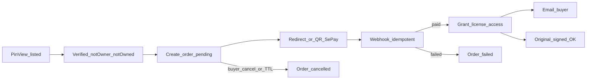

# Business Requirements — Marketplace_Sprint4 (Phase 2.4 Order + SePay)

**Mức chi tiết:** ~3/10 (business). Schema/route → Plan #2.  
**SSOT hệ thống:** [`../../Planing_docs/marketplace/business_requirement.md`](../../Planing_docs/marketplace/business_requirement.md)  
**Index:** [PLANNING_TRIO.md](PLANNING_TRIO.md)  
**Prerequisite:** Marketplace_Sprint1–3 **CLOSED** (`f2a3b4c5d6e7`)

> **Plan #1 CHỐT 2026-08-08** — cắt §3.D + D6–D9 + C04/C05/C12/C13; S1–S8 all suggest.

---

## 1. Mục tiêu

Ship **checkout + thanh toán SePay + cấp quyền tải original**:

| # | Năng lực |
|---|----------|
| 1 | Buyer tạo order từ pin đang `listed` |
| 2 | Thanh toán SePay-first (sandbox/prod qua config) |
| 3 | Order: `pending` → `paid` \| `failed` \| `cancelled` — **không** refund state |
| 4 | Webhook idempotent; chỉ `paid` → grant `pin_license_access` + email buyer |
| 5 | Gate: email verified; không tự mua pin mình; không mua lại nếu đã có access |
| 6 | Charge USD/VND theo **listing** (USD mặc định khi seller chọn USD) |
| 7 | Snapshot hoa hồng trên order lúc `paid`; **chưa** auto-chuyển khoản seller |
| 8 | FE: CTA mua trên PinView + trạng thái pending / đã mua |

**Không** VNPay · refund in-app · DRM · certificate đầy đủ (Sprint5).

---

## 2. Actors

| Actor | Sprint4 |
|-------|---------|
| Buyer | Checkout; thanh toán; nhận email; tải original sau paid |
| Seller | Nhận notify tối thiểu sau bán; tiền về method = vận hành tay / sau |
| Hệ thống | SePay webhook idempotent; grant access; snapshot commission; TTL cancel pending |
| Visitor / unverified | Không checkout |

---

## 3. Quy tắc nghiệp vụ

### 3.1 Đã chốt từ system BR

| ID | Quy tắc |
|----|---------|
| D6 | Provider MVP = **SePay**; VNPay sau |
| D7 | **Không** refund / return trong hệ thống |
| D8 | Currency: USD + VND; **USD mặc định** (theo listing seller) |
| D9 | Buyer: login + email verified; không tự mua pin mình |
| C04 | Buyer paid → original OK |
| C05 | Webhook trùng → không cấp quyền 2 lần |
| C12 | Chưa verified → chặn checkout |
| C13 | User yêu cầu refund in-app → **không hỗ trợ** |

### 3.2 Quyết định sprint (S1–S8 CHỐT)

| ID | Chủ đề | **CHỐT** |
|----|--------|----------|
| **S1** | Mô hình bán | **Nhiều buyer** cùng pin: mỗi `(buyer, pin)` mua 1 lần; listing **giữ `listed`** sau bán |
| **S2** | Checkout UI | CTA **Buy license** trên **PinView** (không trang cart) |
| **S3** | Tiền tệ | Charge đúng `listing.currency` + `price_minor` — buyer **không** đổi currency |
| **S4** | SePay MVP | Contract SePay thật + mode sandbox/mock webhook cho smoke local |
| **S5** | Payout seller | Lúc `paid`: snapshot `commission_percent`, `commission_minor`, `seller_net_minor`, `payout_status=pending`; **không** API chuyển khoản Sprint4 |
| **S6** | Pending trùng | Tối đa **1** order `pending` / `(buyer, pin)` — tạo lại → reuse hoặc 409 (Plan #2) |
| **S7** | Hết hạn pending | Auto `cancelled` sau TTL (config, gợi ý 30 phút) |
| **S8** | Seller sau paid | Notify tối thiểu (email hoặc in-app stub); chuyển tiền tay / sprint sau |

### 3.3 Order & thanh toán

- States: `pending` → `paid` | `failed` | `cancelled` only.  
- Chỉ webhook/`paid` đáng tin → grant. Không tin client “đã trả”.  
- Một license personal use perpetual / lần mua; UNIQUE `(user_id, pin_id)` trên access.  
- Platform **không** ví nội bộ / balance endpoint.

### 3.4 Luồng (nghiệp vụ)

---

## 4. Acceptance criteria

| AC | Mô tả | Case |
|----|-------|------|
| AC-01 | Tạo order từ listing `listed` khi đủ gate | — |
| AC-02 | Self-buy / chưa verified / đã có access → chặn | C11 C12 |
| AC-03 | Sau SePay paid → 1 row `pin_license_access` + order `paid` | C04 |
| AC-04 | Webhook trùng → không grant lần 2 | C05 |
| AC-05 | Buyer paid tải original | C04 |
| AC-06 | Order chỉ `pending\|paid\|failed\|cancelled` — không refund path | C13 |
| AC-07 | Email buyer sau paid | — |
| AC-08 | FE PinView: mua / đang pending / đã mua | — |
| AC-09 | Commission snapshot trên order; không wallet balance | D2 |

---

## 5. Ngoài phạm vi

- VNPay song song · chargeback automation  
- Refund / return in-app  
- DRM · copyright certificate đầy đủ (Sprint5)  
- Cart nhiều pin · auto payout bank/e-wallet API  

---

## 6. Trace → Plan #2

AC → `plan_mode_decisions.md` + `devplan_checklist.md`.

**Plan #2 quiz gợi ý:**

1. Pending trùng: A) **reuse** order pending cùng `(buyer,pin)` **(suggest)** · B) luôn 409  
2. Idempotency webhook: A) bảng `payment_events` unique provider event id **(suggest)** · B) chỉ unique trên order  
3. SePay UX: A) redirect URL **(suggest)** · B) QR embed PinView  
4. TTL cancel: A) Celery beat job **(suggest)** · B) lazy cancel khi đọc order  
5. Seller notify: A) email **(suggest)** · B) chỉ in-app stub  
6. Order table shape: A) một bảng `pin_orders` + FK listing/pin/buyer **(suggest)** · B) tách payment intent riêng ngay MVP  

Trả lời `q1…` hoặc **all suggest**.
