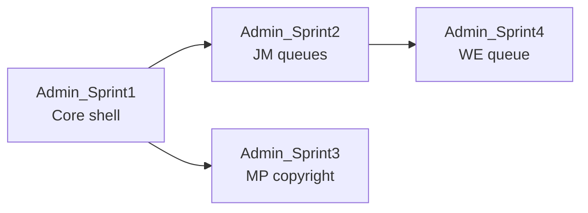

# Admin Ops — sprint map

> **Synced 2026-08-08** sau Plan #1 hệ thống CHỐT (`all suggest`).  
> **SSOT nghiệp vụ:** [`business_requirement.md`](business_requirement.md)  
> **Survey:** [`system_survey.md`](system_survey.md)

---

## 1. Bảng map

| Phase | Sprint folder | Mục tiêu shippable | Phụ thuộc | Pull |
|-------|---------------|--------------------|-----------|------|
| **3.1** | `Admin_Sprint1` | Admin shell + roles UI + audit viewer + pin/comment moderation + overview counts | Gate 3 phase | ADM-01, ADM-07 |
| **3.2** | `Admin_Sprint2` | JM: KYC queue+docs, credentials override UI, JD reports + suspend | Sprint1 | ADM-02, ADM-03, ADM-04, ADM-06 nhẹ |
| **3.3** | `Admin_Sprint3` | MP: copyright queue; resolve → **unlist**; optional report rate-limit | Sprint1 | SEC-T2-01/02/08 |
| **3.4** | `Admin_Sprint4` | Work-exp admin pending **list API** + UI; polish | Sprint2 | Q4 CHỐT |

**Hard rules**

1. Không implement UI trước Plan #1 **sprint** CHỐT.  
2. Không nhét payment/chargeback admin vào Sprint1–4.  
3. ADM-05 / ADM-08 out MVP.  
4. Copyright: unlist khi resolve; **không** revoke license trong MVP.

---

## 2. Chi tiết sprint

### Admin_Sprint1 — Core shell **CLOSED**

**In:** `/admin` layout; guard `admin`; Overview **counts**; Users/Roles; Audit viewer; delete pin + comment UI.  
**Out:** KYC/JD/copyright **queue UI**; unlist API; work-exp list.  
**Closed:** 2026-08-08 · smoke `ALL_SMOKE_PASS` · head vẫn `b4c5d6e7f8a9`

### Admin_Sprint2 — JM ops **CLOSED**

**In:** KYC list/decide/doc preview; credentials override; job-reports + suspend/unsuspend.  
**Out:** Multi-claim dispute (ADM-05).  
**Closed:** 2026-08-11 · smoke `ALL_SMOKE_PASS` · head `b4c5d6e7f8a9`

### Admin_Sprint3 — MP ops **CLOSED**

**In:** Copyright reports queue; decide UI; API unlist khi resolve; rate-limit tạo report.  
**Out:** Order/payout admin; revoke license.  
**Closed:** 2026-08-11 · smoke `ALL_SMOKE_PASS` · head `b4c5d6e7f8a9`

### Admin_Sprint4 — Work-exp **CLOSED**

**In:** `GET` admin work-exp pending + UI approve/reject; overview count.  
**Out:** Analytics.  
**Closed:** 2026-08-11 · smoke `ALL_SMOKE_PASS` · head `b4c5d6e7f8a9`

---

## 3. Implement_docs

| Sprint | Path | Status |
|--------|------|--------|
| 1 | `docs/Implement_docs/Admin_Sprint1/` | **CLOSED** 2026-08-08 |
| 2 | `docs/Implement_docs/Admin_Sprint2/` | **CLOSED** 2026-08-11 |
| 3 | `docs/Implement_docs/Admin_Sprint3/` | **CLOSED** 2026-08-11 |
| 4 | `docs/Implement_docs/Admin_Sprint4/` | **CLOSED** 2026-08-11 |

---

## 4. Trạng thái map

| Hạng mục | Status |
|----------|--------|
| Admin_Sprint1–4 | **CLOSED** |
| Phase 3.x MVP | **COMPLETE** |
