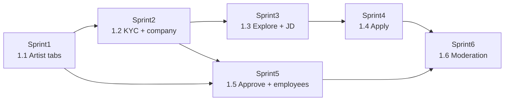

# Job Market — sprint map (synced)

> **Ngày sync:** 2026-07-26  
> **SSOT nghiệp vụ:** [`business_requirement.md`](business_requirement.md) (D1–D16)  
> **Out of scope / admin-later:** [`../deferred_and_out_of_scope_backlog.md`](../deferred_and_out_of_scope_backlog.md)  
> **Implement root:** `docs/Implement_docs/JobMarket_SprintN/` — Sprint1–6 **CLOSED**; Marketplace next
> **Numbering:** Phase 1 = Job Market. Map dưới **thay** bản 1.1–1.5 cũ (quá nhẹ so với KYC + explore + apply).

---

## 1. Bảng map (6 sprint)

KYC legal-entity + apply/explore làm nặng hơn dự kiến ban đầu → **tách KYC thành sprint riêng**; moderation giữ sprint cuối.

| Phase | Sprint folder | Mục tiêu shippable | Phụ thuộc | Hygiene / song song | SAC chính |
|-------|---------------|--------------------|-----------|---------------------|-----------|
| **1.1** | `JobMarket_Sprint1` | Artist profile tabs + work-exp CRUD + CV owner (max 3) + **credentials owner CRUD** + role-aware FE | Phase 0 CLOSED | HY-01 upload auth/ownership; HY-06 `/me/roles` + bỏ `danya` FE | SAC-01, 03, 04 (owner CV), một phần SAC-02 (CRUD/sort, chưa approve) |
| **1.2** | `JobMarket_Sprint2` | `companies` + `company_verification_requests` + hiring-rights KYC + legal-entity unique + company profile tab | Sprint1 | Audit actions KYC (HY-05); private doc storage | SAC-10; SAC-09 (profile company) |
| **1.3** | `JobMarket_Sprint3` | Explore JD + JD detail route + company quản lý JD (owner) + đóng JD + tab đang tuyển | Sprint2 (hiring rights) | — | SAC-05; SAC-09 (JD manage / đang tuyển) |
| **1.4** | `JobMarket_Sprint4` | Apply popup + application statuses + notify mail/in-app + view-CV route + list ứng viên trong JD manage | Sprint3 + Sprint1 CV | HY-02 SSE/auth + mark-read ownership | SAC-06, 07, 08; D9 email gate; D12–D14 |
| **1.5** | `JobMarket_Sprint5` | Work-exp **approve** in-app + notify company/artist + employee tab (auto list + head + public/private) | Sprint2 company + Sprint1 work-exp | Audit approve (HY-05) | SAC-02 (approve/notify); SAC-09 (nhân viên) |
| **1.6** | `JobMarket_Sprint6` | Trust & moderation tối thiểu: report JD, flag/suspend company, harden CV/KYC file rules còn thiếu | Sprint2–5 | HY-04 `require_roles` OR nếu cần; ADM-* UI đầy đủ = backlog | SAC-12; §3.E |

---

## 2. Chi tiết từng sprint

### JobMarket_Sprint1 — Phase 1.1 Artist foundation

**In**

- Profile user: tabs Profile cơ bản (giữ) / Work experience / Education-licensing (đọc) / CV (owner)
- Work-exp: CRUD, employment type, dates validation, free location, auto sort theo `start_date`
- Company trên dòng: free-text hoặc suggest (suggest đầy đủ sau khi có `companies` ở Sprint2)
- Status dòng: chưa approve mặc định; company ngoài hệ thống luôn chưa approve
- Education / licensing / awards: **owner CRUD** (không university approve; admin override API optional; UI admin = ADM-03 backlog)
- CV: upload/xóa; max 3; xóa list ⇒ xóa file; hard block non-owner; email bắt buộc trước upload (D9)
- FE: hydrate `/me/roles`; Settings chỗ neo nút hiring-rights (stub link tới Sprint2); Aside có thể thêm entry Explore sau Sprint3
- Pins tab: không đụng như deliverable JM

**Out**

- Hiring KYC, JD, apply, work-exp approve notify, employee tab, Admin UI đầy đủ  
- Badge verified tổng (JM-05), university role (JM-01), backfill (JM-03)

**Prove-done gợi ý**

- Owner CRUD work-exp + sort đúng  
- Non-owner không list/xóa CV (403)  
- Upload CV thứ 4 bị từ chối; chưa email → bị chặn kèm CTA  
- Owner CRUD credentials (education/licensing/award); visitor chỉ đọc; non-owner mutate → 403  
- Admin override API vẫn tạo được (optional)  

---

### JobMarket_Sprint2 — Phase 1.2 Company + hiring-rights KYC

**In**

- Bảng/`companies` + `company_verification_requests` (tách record)
- Legal-entity unique: `country + authority + type + normalized_registration_number`; raw + normalized; tách tax_id / vat_number
- Settings → Yêu cầu quyền tuyển dụng: điều kiện đầu vào, field bắt buộc/điều kiện, docs, cam kết, e-sign metadata
- Private file KYC; review language English; `document_translation` khi không phải English
- Luồng trùng mã theo trạng thái active/pending/rejected/suspended/deleted (BR §3.D)
- Admin **API** duyệt / need_more_info / reject (UI product = ADM-02 backlog)
- Sau approve: cấp hiring rights + ownership một pháp nhân
- Company profile tab: tên, địa chỉ/chi nhánh, ngành, mô tả, size min–max
- Domain/name: cảnh báo trùng, không hard unique

**Out**

- Multi-member self-serve (JM-09); Admin tranh chấp UI đầy đủ (ADM-05)  
- JD / apply  

**Prove-done gợi ý**

- Submit KYC thiếu điều kiện đầu vào → báo thiếu gì  
- Nhiều request pending cùng key được phép; admin chọn một; không lộ requester cho nhau  
- Active verified → không tạo company mới  
- Reject rồi submit lại → cùng company candidate, không spawn company mới  
- Approve → `employer` + owner + profile org thay artist (AC-15)  
- User chưa hiring rights → 403 mutate company profile  

---

### JobMarket_Sprint3 — Phase 1.3 Explore JD + quản lý JD

> **CLOSED** 2026-08-01 — Implement: [`../../Implement_docs/JobMarket_Sprint3/`](../../Implement_docs/JobMarket_Sprint3/); Alembic `e5f6a7b8c9d0`.

**In**

- `job_posts` với title + years experience bắt buộc; mô tả / yêu cầu / quyền lợi free text; salary mode (you'll love it vs min/max); locations từ chi nhánh profile (multi)
- Company: tab đang tuyển; tab quản lý JD **owner-only** hard block; đóng JD chủ động
- Explore JD (nav lớn): list JD active; search title+company; filter years / salary / location text
- Vue route **JD detail** (chưa bắt buộc hoàn tất apply — CTA có thể disabled đến Sprint4 hoặc hiện nhưng 501/coming — ưu tiên **ship detail + CTA wire** sang Sprint4)

**Out**

- Application state machine đầy đủ (Sprint4)  
- Ranking phức tạp (JM-10)

**Prove-done gợi ý**

- Non-owner quản lý JD → 403  
- Explore chỉ active; filter/search khớp  
- Tạo JD thiếu title hoặc years → 400  
- Đóng JD → không còn trên explore  

---

### JobMarket_Sprint4 — Phase 1.4 Apply pipeline

> **CLOSED** 2026-08-01 — Implement: [`../../Implement_docs/JobMarket_Sprint4/`](../../Implement_docs/JobMarket_Sprint4/); Alembic `f6a7b8c9d0e1`.

**In**

- Apply popup: cover **file** optional + lời ngỏ **text** + CV từ tab (1/3) hoặc upload máy **one-shot không vào quota 3**
- Email gate trước apply (D9)
- Status: submitted → viewed (khi employer mở view CV) → rejected | passed; **không** interview
- Vue route **view CV** + nút tải; ACL employer của JD đó
- Notify: company (profile + view CV links); ứng viên khi viewed/rejected/passed (link JD detail)
- Trong quản lý JD detail: list ứng viên + mở profile / view CV / đổi status

**Out**

- Chat–application bắt buộc (JM-08)  
- Interview status (JM-02)

**Prove-done gợi ý**

- Apply từ máy không tăng số CV trong tab owner  
- Mở view CV lần đầu → status viewed + notify ứng viên  
- Non-employer không tải CV application  
- Đóng JD → không apply thêm  

---

### JobMarket_Sprint5 — Phase 1.5 Work-exp approve + employees

**In**

- Khi artist gắn company **trong hệ thống**: notify email + in-app tới company; deep-link tab work-exp; nút approve **đúng dòng**
- Approve / reject; status dòng cập nhật; audit
- Employee tab: auto list artist đang làm (past→present); sort theo gia nhập; head people free CRUD (chỉ user hệ thống đang làm); public/private + hard block khi private

**Out**

- Email-token company ngoài hệ thống (JM-04)  
- Badge verified tổng (JM-05)  
- Backfill khi company xuất hiện sau (JM-03)

**Prove-done gợi ý**

- Free-text company ngoài hệ thống → không gửi approve notify  
- Chỉ owner company approve đúng dòng  
- Private employees → user khác 403  
- Head chỉ chấp nhận user đang present tại company  

---

### JobMarket_Sprint6 — Phase 1.6 Trust & moderation

**In**

- Report JD + xử lý admin API tối thiểu  
- Flag / suspend company (chặn hiring/JD theo rule)  
- Siết còn lại allowlist/size CV & KYC nếu gap  
- `require_roles` OR nếu moderation cần admin|employer  

**Out**

- Admin UI moderation đầy đủ (ADM-04)  
- Marketplace / SIEM  

**Prove-done gợi ý**

- Report tạo được; admin đọc/xử lý qua API  
- Company suspended → không post/apply theo rule đã chốt sprint  
- Regression Sprint1–5 smoke  

---

## 3. Ánh xạ Out-of-scope (không đưa vào sprint trên)

Mọi ADM-*, JM-01…15 (trừ phần in-scope đã liệt kê), MP-*, NO-* → [`../deferred_and_out_of_scope_backlog.md`](../deferred_and_out_of_scope_backlog.md).

Hygiene HY-* gắn cột “Hygiene” bảng §1 — làm kèm sprint ghi chú, không mở Phase 0-core mới.

---

## 4. Quy ước mở Implement_docs

1. Tạo `docs/Implement_docs/JobMarket_SprintN/`  
2. `base requirement.md` (slice từ sprint này)  
3. Plan #1 → `business_requirement.md` sprint  
4. Plan #2 → `devplan_checklist.md`  
5. Implement + smoke + tick  
6. Cập nhật README job_market + phase plan gốc  

**Hard stop:** chưa có bộ 3 Sprint N → không code domain sprint đó.  
**Thứ tự:** Sprint1 → 2 → 3 → 4; Sprint5 có thể song song kỹ thuật sau Sprint2 nếu team tách được, nhưng **gate nghiệp vụ** approve cần company đã verify.

---

## 5. Trạng thái

| Hạng mục | Status |
|----------|--------|
| Phase 0-core | CLOSED |
| System BR D1–D16 | Chốt hướng |
| Deferred backlog file | Có |
| Sprint map | **Synced** — Sprint1–6 CLOSED; Marketplace next |
| `Implement_docs/JobMarket_Sprint1–4` | **CLOSED** (heads … → `e5f6a7b8c9d0` → `f6a7b8c9d0e1`) |
