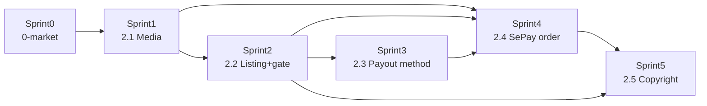

# Marketplace — sprint map (synced)

> **Sync:** 2026-08-08 sau Plan #1 CHỐT (D1–D10).  
> **SSOT nghiệp vụ:** [`business_requirement.md`](business_requirement.md)  
> **Blocks:** [`phase0_market_and_block_classification.md`](phase0_market_and_block_classification.md)  
> **Deferred:** [`../deferred_and_out_of_scope_backlog.md`](../deferred_and_out_of_scope_backlog.md) MP-* / refund  
> **Trạng thái map:** **Synced** — sẵn mở Implement Sprint0.

---

## 1. Bảng map

| Phase | Sprint folder | Mục tiêu shippable | Phụ thuộc | Case |
|-------|---------------|--------------------|-----------|------|
| **0-market** | `Marketplace_Sprint0` | `created_at`; `pin_stats`; unique likes/follows; **wipe pin cũ OK** nếu cần | JM CLOSED | C08, C10 |
| **2.1** | `Marketplace_Sprint1` | Preview/original; static watermark; ACL + signed URL | Sprint0 | C01–C04 |
| **2.2** | `Marketplace_Sprint2` | Gate N=5/M=100/K=10 + payment method; role `seller`; listing 1-shot personal license | Sprint0+1 | C06–C07, C11 |
| **2.3** | `Marketplace_Sprint3` | Seller payment_methods (bank/e-wallet); không ví nội bộ | Sprint2 | C07 |
| **2.4** | `Marketplace_Sprint4` | Orders; SePay; USD default (+VND); grant access; **no refund** | Sprint1–3 | C04–C05, C12–C13 |
| **2.5** | `Marketplace_Sprint5` | Copyright report + hash + certificate | Sprint2+4 | C09 |

**Hard rules**

1. Không Sprint4 trước Sprint0+1 CLOSED.  
2. Không implement refund/return.  
3. Pin cũ: được truncate/wipe khi conflict (D10).

---

## 2. Chi tiết sprint

### Marketplace_Sprint0 — 0-market data

**In:** migrations data foundation; unique constraints; optional wipe pins + related rows nếu pipeline mới conflict; smoke C08/C10.  
**Out:** UI bán; watermark đầy đủ (có thể stub path).

### Marketplace_Sprint1 — Media 2.1

**In:** original/preview dirs; Celery static watermark; public serve preview; original ACL + signed URL.  
**Out:** Checkout.

### Marketplace_Sprint2 — Listing + gate

**In:** eligibility engine (N/M/K + method); assign `seller`; license one-shot personal; FE bán trên CreatePin/PinView.  
**Out:** Charge thật (sandbox mock OK).

### Marketplace_Sprint3 — Payment methods

**In:** CRUD payout method; gate phụ thuộc method; commission % config.  
**Out:** Buyer charge.

### Marketplace_Sprint4 — Order + SePay

**In:** order states; SePay webhook idempotent; USD default; VND supported; email sau paid; block self-buy + email gate.  
**Out:** VNPay; refund.

### Marketplace_Sprint5 — Copyright

**In:** attestation; hash; report + admin API; certificate tối thiểu.  
**Out:** Admin UI product.

---

## 3. Implement_docs

| Sprint | Path | Status |
|--------|------|--------|
| 0 | [`../../Implement_docs/Marketplace_Sprint0/`](../../Implement_docs/Marketplace_Sprint0/) | **CLOSED** · `c9d0e1f2a3b4` |
| 1 | [`../../Implement_docs/Marketplace_Sprint1/`](../../Implement_docs/Marketplace_Sprint1/) | **CLOSED** · `d0e1f2a3b4c5` |
| 2 | [`../../Implement_docs/Marketplace_Sprint2/`](../../Implement_docs/Marketplace_Sprint2/) | **CLOSED** · `e1f2a3b4c5d6` |
| 3 | [`../../Implement_docs/Marketplace_Sprint3/`](../../Implement_docs/Marketplace_Sprint3/) | **CLOSED** · `f2a3b4c5d6e7` |
| 4 | [`../../Implement_docs/Marketplace_Sprint4/`](../../Implement_docs/Marketplace_Sprint4/) | **CLOSED** · `a3b4c5d6e7f8` |
| 5 | [`../../Implement_docs/Marketplace_Sprint5/`](../../Implement_docs/Marketplace_Sprint5/) | **CLOSED** · `b4c5d6e7f8a9` |

Quy trình mỗi sprint: base → Plan #1 BR → Plan #2 tech + checklist → code → đóng → cập nhật README.

---

## 4. Trạng thái

| Hạng mục | Status |
|----------|--------|
| Plan #1 BR hệ thống | **CHỐT** 2026-08-08 |
| Sprint map | **Synced** |
| Sprint0 Plan #2 | **CHỐT** 2026-08-08 |
| Implement Sprint0 | **CLOSED** · Alembic `c9d0e1f2a3b4` |
| Implement Sprint1 | **CLOSED** · Alembic `d0e1f2a3b4c5` |
