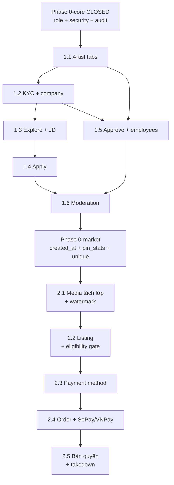

# Marketplace & Job Market — Feasibility, Codebase Survey & Phase Plan

> **Ngày khảo sát:** 2026-07-25  
> **Cập nhật numbering:** 2026-07-26 — Job Market = Phase **1.x**; Marketplace = Phase **2.x** (đổi từ 2.x / 1.x trong bản explore ban đầu vì Job Market ship trước).  
> **Phạm vi:** Đánh giá khả thi cơ bản + khảo sát codebase/DB + phase plan cho 2 hệ thống gắn art/pin trong web gốc.  
> **Chưa đi sâu:** chi tiết SePay/VNPay, schema cuối cùng từng sprint.  
> **Trạng thái:** Phase 0-core **CLOSED**. Job Market planning **mở** tại [`job_market/`](job_market/).

---

## 0.A. Quyết định hướng triển khai (chốt 2026-07-25; numbering cập nhật 2026-07-26)

**Hướng đã chọn: Hybrid — nền chung làm trước, rồi phase-by-phase. Job market trước, Marketplace sau.**

Lý do (tóm tắt debate): "làm 1 hay 2" là câu hỏi sai vì **không phải block nào cũng là block chung**. Chỉ phần đụng vào auth/security/role là loại "sửa sau rất đắt" → làm dứt điểm một lần. Phần còn lại phụ thuộc yêu cầu chưa chốt (ngưỡng eligibility) → để trong stream tương ứng.

**Phân loại lại Phase 0:**

| Block | Loại | Thời điểm làm |
|-------|------|---------------|
| 0.4 Role/capability | **Global thật** | Làm trước, một lần — **DONE** |
| 0.5 Ownership check + siết CORS/TrustedHost/cookie/CSRF | **Global thật** | Làm trước, một lần — **DONE** |
| 0.6 Audit log (bản tối thiểu) | **Global** | Làm trước, tối thiểu — **DONE** |
| 0.1 `pins.created_at` | Marketplace-specific | Trong stream Marketplace (Phase 2) |
| 0.2 `pin_stats` | Marketplace-specific | Trong stream Marketplace (Phase 2) |
| 0.3 unique `subscriptions`/`likes` | Nghiêng Marketplace + hygiene | Trong stream Marketplace (có thể kéo sớm nếu tiện) |

**Thứ tự thực thi đã chốt:**

1. **Phase 0-core** (0.4 + 0.5 + 0.6 tối thiểu) — nền chung — **CLOSED**.
2. **Job market (Phase 1.1 → 1.6)** — thử lửa nền chung ở môi trường không dính tiền — **đang planning** (sprint map synced).
3. **Marketplace (Phase 2.x)** — bắt đầu bằng Phase 0-market (0.1/0.2/0.3) rồi 2.1 → 2.5.

> Ranh giới nguyên tắc: **global thì làm dứt điểm trước; phase-specific thì để trong phase.**

### Cấu trúc tài liệu

| Tầng | Path | Nội dung |
|------|------|----------|
| Phase / explore / sprint map cấp cao | `docs/Planing_docs/marketplace_jobmarket_feasibility_phase_plan.md` (+ README) | File này |
| Planning chính Job market | `docs/Planing_docs/job_market/` | BR hệ thống, Phase **1.x** |
| Planning chính Marketplace | `docs/Planing_docs/marketplace/` | BR hệ thống, Phase **2.x** + 0-market |
| Implement từng sprint | `docs/Implement_docs/<Name>_SprintN/` | Bộ 3 + BR chi tiết; rule trong `lessonlearn.md` |

---

## 0.B. Sprint map — Phase 0-core

> Phase 0-market (0.1/0.2/0.3) **không** thuộc map này — map khi mở stream Marketplace.

| Sprint | Block | Mục tiêu shippable | Implement folder | Phụ thuộc |
|--------|-------|--------------------|------------------|-----------|
| **Phase0-Sprint1** | 0.4 | Role & capability foundation; thay hardcode admin `username == "danya"` | [`docs/Implement_docs/Phase0_Sprint1/`](../Implement_docs/Phase0_Sprint1/) — **CLOSED 2026-07-25** | — |
| **Phase0-Sprint2** | 0.5 | Ownership check pin/board/comment + siết CORS/TrustedHost/cookie/CSRF | [`docs/Implement_docs/Phase0_Sprint2/`](../Implement_docs/Phase0_Sprint2/) — **CLOSED 2026-07-25** | Sprint1 đóng |
| **Phase0-Sprint3** | 0.6 | Audit log tối thiểu (append-only + helper + hook mutation quan trọng) | [`docs/Implement_docs/Phase0_Sprint3/`](../Implement_docs/Phase0_Sprint3/) — **CLOSED 2026-07-25** | Sprint2 đóng |

> **Phase 0-core CLOSED 2026-07-25** — smoke + manual API test pass. Stream kế tiếp: Job Market planning.

### Chi tiết từng sprint

#### Phase0-Sprint1 — Role & capability (**CLOSED 2026-07-25**)

- **In:** model role gắn user; kiểm quyền theo role; migrate quyền admin cũ; wire `/admin/*`; API gán/gỡ role; `GET /users/me/roles`.
- **Out:** CSRF/CORS/cookie, ownership pin, audit, UI Job/Marketplace / Admin UI.
- **Prove-done:** `scripts/smoke_phase0_sprint1.py` → `ALL_SMOKE_PASS`; alembic head `a1b2c3d4e5f6`; không còn hardcode `danya` trong `app/api/rest/`.

#### Phase0-Sprint2 — Ownership & security hardening (**CLOSED 2026-07-25**)

- **In:** helper ownership; 403 khi mutate tài nguyên người khác; CORS/TrustedHost không còn `*`; cookie flags + chiến lược CSRF cho cookie auth.
- **Out:** audit đầy đủ; payment; media watermark.
- **Prove-done:** `scripts/smoke_phase0_sprint2.py` → `ALL_SMOKE_PASS`; ownership 403, CSRF double-submit và CORS allowlist hoạt động.

#### Phase0-Sprint3 — Audit log tối thiểu (**CLOSED 2026-07-25**)

- **In:** bảng `audit_logs` append-only; helper `write_audit` cùng transaction với mutation; hook admin delete pin/comment + gán/thu hồi role; đọc lại qua `GET /admin/audit` và `GET /users/me/audit`.
- **Out:** SIEM, retention phức tạp, UI audit đầy đủ (có thể Extend sau).
- **Prove-done:** `scripts/smoke_phase0_sprint3.py` → `ALL_SMOKE_PASS`; alembic head `b2c3d4e5f6a7`; regression Sprint1/2 pass.

### Thứ tự sau Phase 0-core

1. ~~Đóng Sprint1 → Sprint2 → Sprint3~~ — **xong 2026-07-25**.
2. **Đang làm:** planning Job Market trong `docs/Planing_docs/job_market/` (survey + BR + sprint map Phase 1.1–1.6 synced).
3. Sau Plan #1 chốt BR hệ thống → `docs/Implement_docs/JobMarket_SprintN/`.
4. Sau đóng Job Market → mở `docs/Planing_docs/marketplace/` (Phase 0-market + Phase 2.x).

---

## 0. Tóm tắt ý tưởng

Cả 2 hệ thống nằm **bên trong web gốc**, liên quan đến art / hình ảnh / pins.

### Hệ thống A — Mua bán, thanh toán & bản quyền (Marketplace = Phase 2)

User không chỉ đăng ảnh miễn phí như hiện tại, mà có thêm option **bán quyền sử dụng hình ảnh**. Ba trụ chính:

1. **Điều kiện mở option bán (eligibility gate)**  
   - Có hình thức thanh toán gắn account (thẻ ngân hàng, ví điện tử, …)  
   - Đủ lượng ảnh đã đăng (sản phẩm free trước đó)  
   - Đủ lượng tương tác / view với sản phẩm free  
   - Đủ số follower tối thiểu  

2. **Thanh toán tự động**  
   - Webhook SePay + VNPay (chi tiết provider sau khi vào implement cụ thể)

3. **Bảo vệ bản quyền**  
   - Watermark, mã hóa / hạn chế truy cập bản gốc, …

### Hệ thống B — Job market (Phase 1)

Hai phần chính: **profile nhà tuyển dụng / artist** và **CV / JD**.

Ngoài đăng tuyển + apply, còn:

- Hệ thống tạo **work experience** (giống LinkedIn) từ phía artist  
- Phần **approve** work exp được đề cập trong profile của họ  

---

## 1. Khả thi cơ bản (chưa đi sâu)

| Hệ thống | Verdict | Lý do ngắn |
|----------|---------|------------|
| **Marketplace (Phase 2)** | **Khả thi**, nhưng nặng nhất ở 2 điểm: eligibility gate (thiếu dữ liệu) và bảo vệ file gốc (hiện đang lộ) | Stack đã có Pillow/OpenCV, Celery, media pipeline, Postgres + Alembic → đủ để làm watermark + order + webhook |
| **Job market (Phase 1)** | **Khả thi cao hơn**, ít rủi ro hơn | Chủ yếu CRUD + role + approval flow; tái dùng auth, profile, chat, SSE notification sẵn có |

**Kết luận:** Không có blocker kiến trúc. Cả hai là **domain mới**, gắn vào user/pin hiện tại. Phase 0-core đã xử lý auth/security/role/audit tối thiểu. Block dữ liệu Marketplace (created_at / pin_stats / unique) **không** chặn Job Market.

---

## 2. Khảo sát codebase / database — phát hiện quyết định phase plan

Nguồn chính: `app/postgresql/models.py`, `app/api/rest/pins/routes.py`, `app/api/rest/dependencies.py`, auth/middleware hiện tại.

> Ghi chú 2026-07-26: §2.5 và §2.6 mô tả trạng thái **trước** Phase 0. Sau Phase 0: đã có `user_roles` + `require_roles`; CSRF/CORS/TrustedHost đã siết. Chi tiết handoff: [`job_market/phase0_handoff_and_block_classification.md`](job_market/phase0_handoff_and_block_classification.md).

### 2.1 `pins` không có `created_at`

```python
# app/postgresql/models.py — PinsOrm
# Có: id, user_id, title, description, href, image, videoPreview, rgb, height
# Không có: created_at
```

**Hệ quả:** Không thể tính “đã đăng ảnh free trong X ngày/tháng qua”. Điều kiện mở quyền bán **cần mốc thời gian** → phải thêm `created_at` (+ backfill). **Chỉ chặn Marketplace**, không chặn Job Market.

### 2.2 View count hiện **không tích luỹ**

- Bảng `users_view_pins` là bảng nối `(user_id, pin_id)`.
- Celery task `make_user_recommendations` **xoá sạch** view của user sau khi tính gợi ý.

**Hệ quả:** Cần bảng thống kê riêng (persistent counter theo pin). **Marketplace-only.**

### 2.3 `subscriptions` và `likes` thiếu unique constraint

```python
# SubsrciptionsOrm: id + follower_id + following_id — không unique (follower_id, following_id)
# LikesOrm: tương tự — có thể like trùng
```

**Hệ quả:** Follow trùng ⇒ đếm follower bị lạm dụng cho eligibility. **Marketplace-only** (có thể kéo sớm nếu tiện).

### 2.4 File gốc đang được phục vụ cho **mọi user đã đăng nhập**

```python
# app/api/rest/pins/routes.py
# GET /pins/upload/{id} → FileResponse(full_path) với pin.image gốc
# Không kiểm quyền sở hữu / đã mua license
```

**Hệ quả — điểm chí tử của bản quyền Marketplace:** phải tách preview (watermark) vs original. **Không bắt buộc cho Job Market MVP.**

### 2.5 Role (đã giải quyết ở Phase 0.4)

Trước Phase 0: admin hardcode username. Sau Phase 0: `user_roles` + `require_roles`; catalog gồm `admin`, `artist`, `employer`, `seller`. Employer behavior cho Job Market **chưa** gắn route domain.

### 2.6 CSRF / CORS / TrustedHost (đã giải quyết ở Phase 0.5)

Sau Phase 0: double-submit CSRF, CORS/TrustedHost allowlist từ env. Còn gap hygiene (một số upload/update thiếu ownership) — xem handoff Job Market; làm song song sprint, không mở lại Phase 0-core.

### 2.7 Điểm tái sử dụng được (strengths)

| Thành phần sẵn có | Dùng cho |
|-------------------|----------|
| Auth JWT cookie + Redis revoke | Cả 2 hệ thống |
| `UsersOrm` profile (image, banner, social links, description) | Artist / employer profile mở rộng |
| `user_roles` + `require_roles` + ownership helpers + `write_audit` | Gate + audit domain mới |
| Pin create/upload pipeline | Listing bán + watermark Celery (Marketplace) |
| Celery (email, image processing, notifications) | JD notify, work-exp email, payment email |
| `UpdatesOrm` + SSE | Notify application / work-exp approve / order paid |
| Chat (`chats`, `messages`) | Recruiter–artist / buyer–seller |
| PortfolioView | **Không** phải job market thật — chỉ trang cá nhân tĩnh |
| Alembic + Postgres | Schema mới cho JD, work exp, order, license |

### 2.8 Không tìm thấy remnant job market

Repo tên “no-Job-market-version” khớp thực tế: **không có** bảng/route job, application, work experience, company profile. Chỉ có portfolio/contact cá nhân.

---

## 3. Phase plan

### Phase 0-core — Nền chung (**CLOSED**)

| # | Việc | Trạng thái |
|---|------|------------|
| 0.4 | Role/capability model | DONE — Sprint1 |
| 0.5 | Ownership + CORS/TrustedHost/cookie/CSRF | DONE — Sprint2 |
| 0.6 | Audit log tối thiểu | DONE — Sprint3 |

### Phase 0-market — Block riêng Marketplace (làm khi vào Phase 2)

| # | Việc | Vì sao hoãn |
|---|------|-------------|
| 0.1 | Thêm `pins.created_at` (+ backfill) | Shape phụ thuộc ngưỡng eligibility chưa chốt |
| 0.2 | Bảng `pin_stats` (view/like bền vững) | Chỉ Marketplace dùng |
| 0.3 | Unique constraint `subscriptions` / `likes` | Chống gian lận ngưỡng follower |

---

### Hệ thống Job market — Phase 1.1 → 1.6

> Chi tiết: [`job_market/`](job_market/). Sprint map synced: [`job_market/sprint_map.md`](job_market/sprint_map.md). Implement: `docs/Implement_docs/JobMarket_SprintN/`.

#### Phase 1.1 — Artist foundation (Sprint1)

- Profile tabs: basic / work-exp / education-licensing (**owner CRUD**) / CV owner max 3
- Work-exp CRUD + auto sort; pins giữ nguyên

#### Phase 1.2 — Company + hiring-rights KYC (Sprint2)

- `companies` + `company_verification_requests`; legal-entity unique; KYC Settings flow; company profile

#### Phase 1.3 — Explore JD + quản lý JD (Sprint3)

- Explore list/search/filter; JD detail route; owner JD CRUD + đóng JD; tab đang tuyển

#### Phase 1.4 — Apply (Sprint4)

- Apply popup; statuses submitted/viewed/rejected/passed; notify; view-CV route; applicants under JD manage

#### Phase 1.5 — Work-exp approve + employees (Sprint5)

- In-app approve/reject + notify; employee tab auto + head + public/private

#### Phase 1.6 — Trust & moderation (Sprint6)

- Report JD; flag company; harden file rules

Out of scope / admin-later: [`deferred_and_out_of_scope_backlog.md`](deferred_and_out_of_scope_backlog.md).

---

### Hệ thống Marketplace — Phase 2.1 → 2.5

> Làm sau Job Market. Bắt đầu bằng Phase 0-market rồi các phase dưới. Planning chính: [`marketplace/`](marketplace/).

#### Phase 2.1 — Media tách lớp (điều kiện tiên quyết của bản quyền)

- Tách thư mục: `media/pins/original/` (private) vs `media/pins/preview/` (public-ish)
- Celery task sinh **preview + watermark**
- Sửa `GET /pins/upload/{id}` → **luôn trả preview**
- Endpoint mới `GET /pins/{id}/original` → chỉ owner hoặc người đã mua license
- Signed URL ngắn hạn cho download bản gốc

#### Phase 2.2 — Listing & eligibility gate

- `pin_licenses`, `seller_profiles`
- Rule engine: payment method + N pins + M engagement + K followers
- UI option “Bán quyền sử dụng” trong CreatePin / PinView

#### Phase 2.3 — Payment method của user

- `payment_methods`: loại (bank / e-wallet), thông tin định danh nhận tiền (payout)

#### Phase 2.4 — Order & thanh toán tự động (SePay + VNPay)

- `orders` + state machine + idempotent webhook
- Sau `paid` → cấp quyền tải original + email hoá đơn

#### Phase 2.5 — Bản quyền & tranh chấp

- Khai báo quyền khi upload; hash file; `copyright_reports`; license certificate

---

## 4. Thứ tự triển khai đề xuất

**Thứ tự đã chốt:** Phase 0-core → Job market (Phase 1) → Marketplace (Phase 2).



Lý do:

- Job market không dính tiền → ship được một stream hoàn chỉnh trước payment.
- Phase 0-core được “thử lửa” bằng job market trước khi đụng giao dịch thật.
- **Không được bỏ Phase 0-market và 2.1** khi vào Marketplace — bán license mà file gốc vẫn tải tự do thì hệ thống bản quyền vô nghĩa.

---

## 5. So sánh nhanh 2 hệ thống

| Tiêu chí | Marketplace (Phase 2) | Job market (Phase 1) |
|----------|----------------------|----------------------|
| Phụ thuộc Phase 0-core | Cao (security) + Phase 0-market | Cao (role, ownership, audit) |
| Phụ thuộc media rewrite | **Bắt buộc** (2.1) | Thấp |
| Rủi ro pháp lý / tiền | Cao | Trung bình (CV/PII) |
| Độ phức tạp webhook | Cao | Thấp |
| Tái dùng chat / SSE / profile | Trung bình | Cao |
| Remnant sẵn trong repo | Không | Không (chỉ PortfolioView nhẹ) |
| MVP ship nhanh hơn | Không | **Có** |

---

## 6. Quyết định cần chốt

### Trước / trong BR Job Market (Phase 1) — ưu tiên ngay

| Chủ đề | Câu hỏi |
|--------|---------|
| Employer onboarding | Admin-assign only vs self-claim role `employer`? |
| Company verification | Bar verified tối thiểu cho MVP? |
| Artist profile shape | Mở rộng cột trên `users` vs bảng `artist_profiles`? |
| Work exp verify | Chỉ company trên hệ thống, hay + email token ngoài? |

### Để khi mở Marketplace (Phase 2)

| Chủ đề | Câu hỏi |
|--------|---------|
| License model | Bán 1 lần / nhiều loại / theo số lần dùng? |
| Payout | Ví nội bộ rồi rút, hay chuyển trực tiếp? Hoa hồng? |
| Watermark | Chỉ cứng trên preview, hay + invisible? |
| Ngưỡng eligibility | N ảnh / M view / K follower cụ thể |

---

## 7. Bước tiếp theo

1. ~~Stakeholder chốt Hybrid + Job market trước~~ — **đã chốt** (§0.A).
2. ~~Implement Phase0-Sprint1 → Sprint3~~ — **CLOSED**.
3. ~~Renumber Job Market = Phase 1; Marketplace = Phase 2~~ — **đã chốt 2026-07-26**.
4. **Ngay:** hoàn thiện / Plan #1 chốt BR hệ thống trong [`job_market/`](job_market/).
5. Sau BR hệ thống → mở `docs/Implement_docs/JobMarket_Sprint1/` (bộ 3) → implement.
6. Sau đóng Job Market → mở planning Marketplace.

---

## 8. Tham chiếu file / code đã khảo sát

| Khu vực | Path |
|---------|------|
| Schema Postgres | `app/postgresql/models.py` |
| Roles / ownership / audit | `app/api/rest/roles.py`, `ownership.py`, `audit.py`, `dependencies.py` |
| Pin create/upload/serve | `app/api/rest/pins/routes.py` |
| Auth / middleware | `app/middlewares.py`, `app/api/rest/security.py` |
| Frontend shell / CSRF | `vuejs/src/App.vue`, `main.js`, `router/index.js`, `UserView.vue` |
| Portfolio (không phải job market) | `vuejs/src/views/PortfolioView.vue` |
| Job Market planning | `docs/Planing_docs/job_market/` |

---

*File này là phase map cấp cao. SSOT nghiệp vụ Job Market nằm trong `job_market/business_requirement.md` sau khi Plan #1 chốt. Không giữ quyết định sprint chỉ trong chat.*
